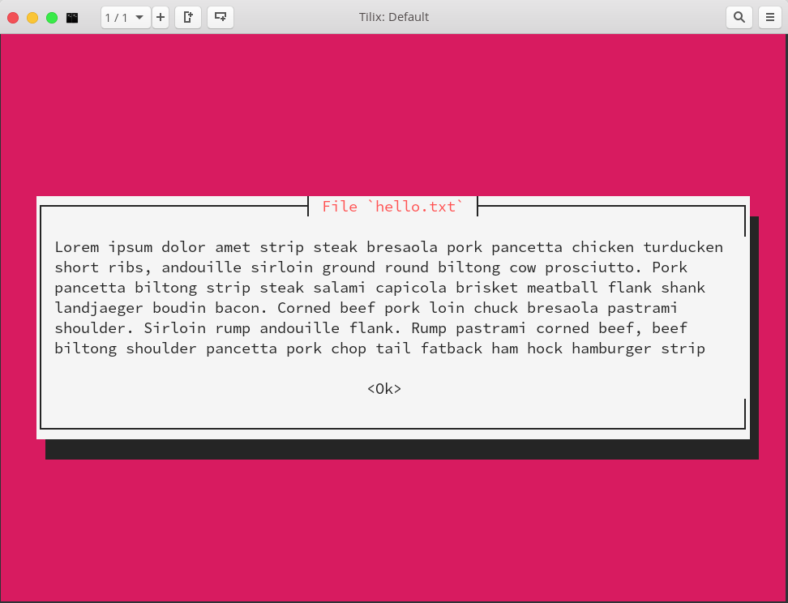

# Bash App Modular

Arrange bash app to modules

## Module

Modules stored at `modules` folder. Each module in a separated folder, and contain a `<module name>.sh` file.

Inside `<module name>.sh` file contain a function named `__module`. App will call this function to execute the module.

Use menu *"Create module"* to create modules.

## Screenshots

Main menu

Read file dialog module

